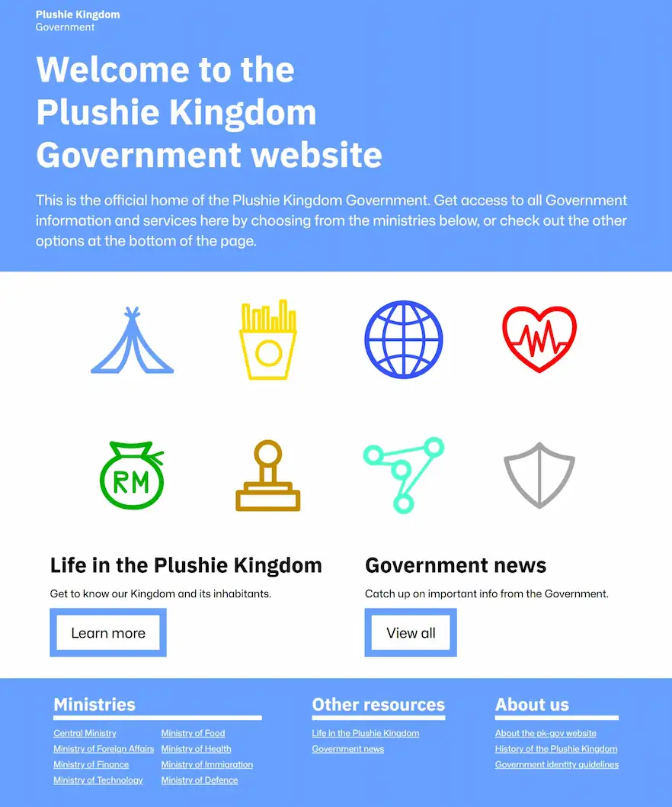
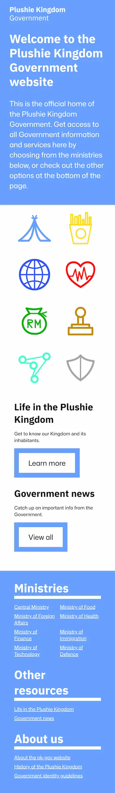

# pk-gov

Fictional government website project for the Plushie Kingdom.

Live demo link: https://pk-gov.onrender.com/

## Technologies used:

- HTML for basic page layout
- CSS for styling page elements and responsive design
- JavaScript for loading lottie animations and handling imports
- 11ty for static page generation from templates
- npm and webpack for managing and bundling code modules
- Git for version control

## Key features:

- Attractive design improves readability and ease-of-use
- Website is responsive for easier navigation on mobile
- Animations indicate interactable buttons and links

## Credits:

- Credits for any external pictures/resources used are included where that particular content is located in the website

## Gallery:

## Getting started:

1. clone this repo in your desired folder: `git clone https://github.com/J0e-Quan/pk-gov.git`
2. `npm install` to install any required dependencies
3. `npm run start` to activate the dev server (View the project by navigating to the localhost address shown in your terminal.)
4. `npm run build` will bundle the code into the 'dist' folder
