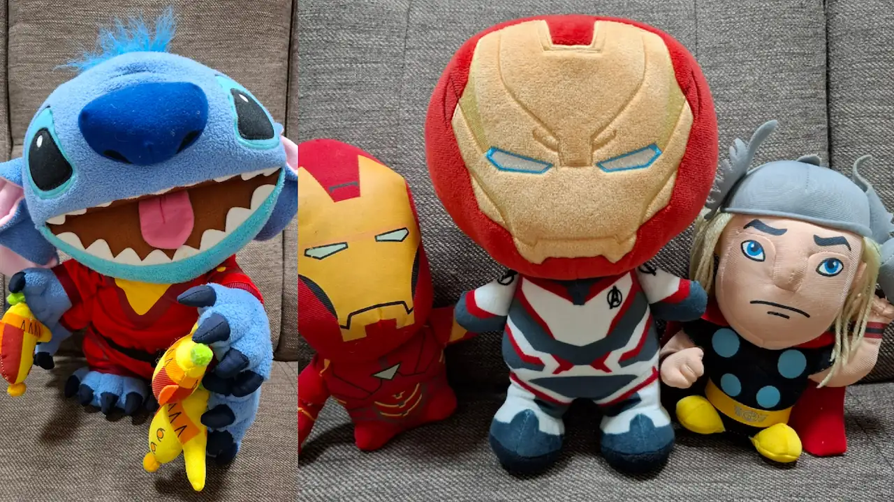
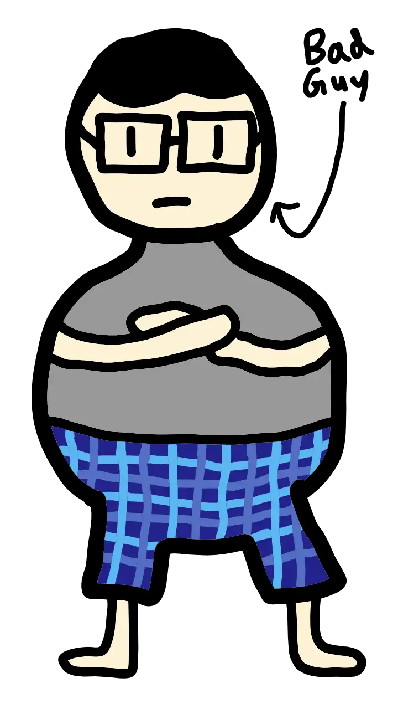
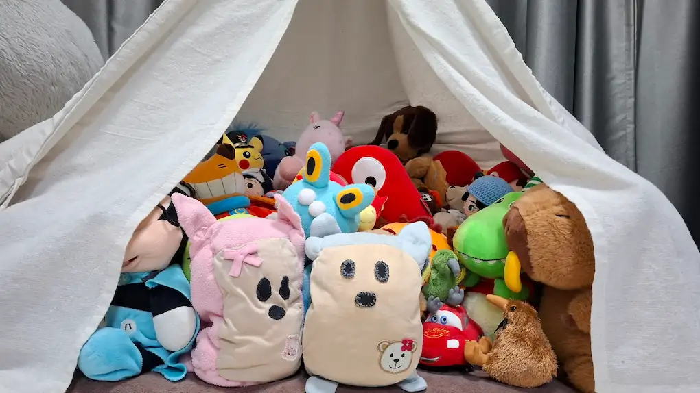
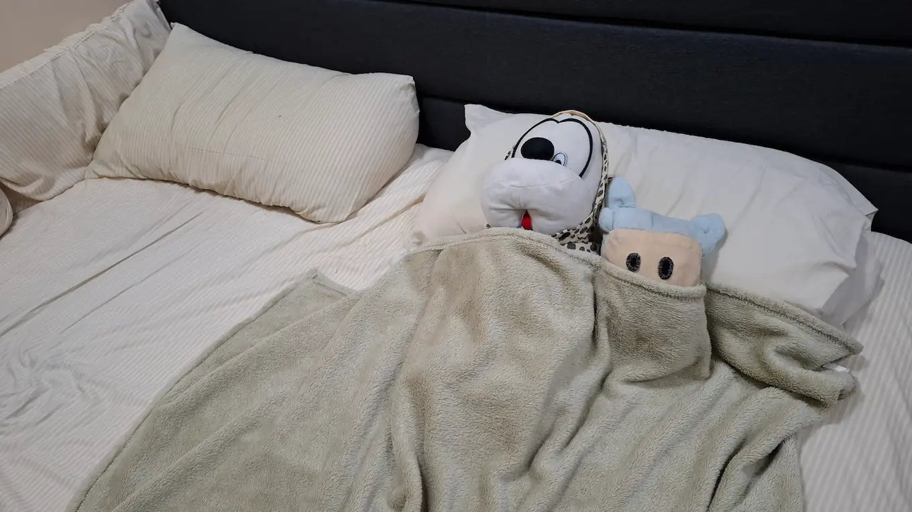
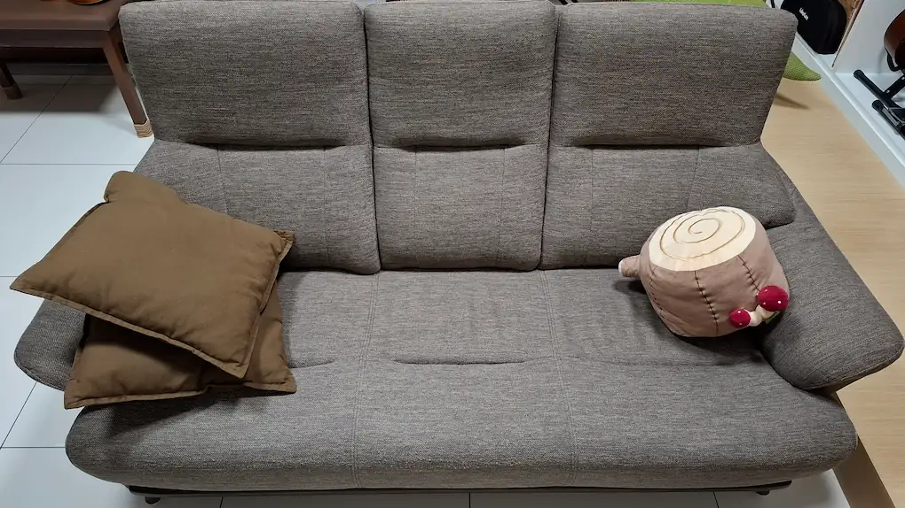
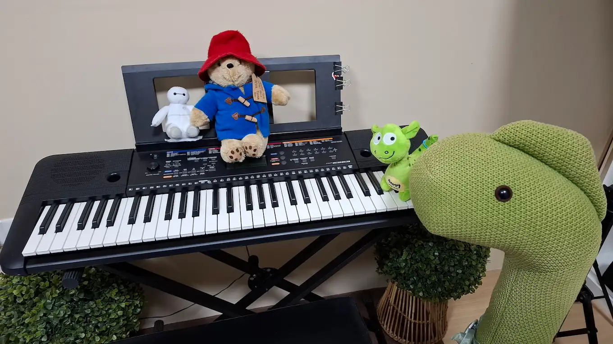

## Safety of the Plushie Kingdom
---
The Plushie Kingdom is located in the peaceful state of Penang, Malaysia. This makes the Kingdom quite a safe place to live in, with a near-zero crime rate and no reported terror attacks or disasters. However, no place is ever perfectly safe, so we have robust safety measures in place to ensure the safety and wellbeing of all plushies in the Kingdom.

### Current known threats
While the Kingdom is extremely safe to live in, it helps to be aware of any potential sources of danger. Currently, we consider such sources to include:
- Damage to the structural integrity of the Big Tent or other residential areas in the greater Plushie Kingdom region
- Kidnapping or harassment from the Bad Guy 
- Being crushed by other plushies in the Big Tent

### What to do in case of danger
If you are unfortunately involved in a dangerous or risky scenario, don't try to overcome it on your own. Immediately contact your nearest Ministry of Defence staff member to get help. All Ministry of Defence staff members have been put through vigorous training to handle a wide range of scenarios, so you can count on them to get you out of danger.

### Sightings of the Bad Guy

  
If you are sure you've seen the Bad Guy near the Plushie Kingdom, and believe he's up to no good, inform your nearest Ministry of Defence staff member as soon as possible. (For new citizens, here's a sketch of his appearance. His outfit may change from time to time but his overall physique and weight probably won't) 

  

## Temporary shelters
---
In case of a major disaster or required temporary migration, the Plushie Kingdom has several locations that can function as temporary shelters. These temporary shelters are only able to be used when explicitly opened by the Government, such as through announcements on the <a class='link' href='/news/'>Government news</a> page. Plushies who do not regularly reside at these locations should NOT freely use them without permission from the Government. The temporary shelters available for use are:
- The Sofa
- The Bedroom
- The Studio

## Places to stay
---
The Plushie Kingdom contains several residential areas, each with their own unique qualities. Most of the Government staff is headquartered in the Big Tent, but Government information and services are available throughout the entire greater Plushie Kingdom region, ensuring equal access to vital resources no matter where you live.

### The Big Tent Plains

Home to the largest population of plushies in the Kingdom, the Big Tent Plains might be more densely packed nowadays, but its vibrant community and atmosphere more than makes up for it! It's also where most of the food and shopping options are located, making for the most energetic night life in the Kingdom. Most Government staff live here too, so whatever you can think of, it's all here at the Big Tent Plains!

### The Big Tent Stacks
Located at the left and right ends of the Big Tent, the Big Tent Stacks are made up of two multi-storey structures, capable of housing many plushies. Built to handle the increased number of residents after The Great Reunification, these residential areas provide easy access to the various amenities in the Big Tent Plains, making this a desirable location for plushies in high spirits! (Due to their higher-density nature, only smaller-sized plushies are allowed to live in the Big Tent Stacks.)

### The Bedroom

This is the luxurious residence of the Prime Minister and the King, after his 2024 departure from the Plushie Kingdom. It has the largest livable land area in the Kingdom by far, and is also located further out in the greater Plushie Kingdom region, providing unbeatable peace and serenity. Due to its large size, the Bedroom can also function as a temporary shelter if needed.

### The Sofa

As the closest residential area to the Big Tent in the greater Plushie Kingdom region, the Sofa is capable of housing many plushies, and is used as the main temporary shelter if needed. As it is mostly uninhabited due to the lack of amenities, the Sofa can also be used as an event space! The Sofa is also used for Government-related media operations, such as taking staff photos and making video versions of major announcements.

### The Studio

Located next to the Sofa, this is the newest residential area in the Kingdom! It's where the Foreign Minister resides to provide a convenient and safe location for diplomatic discussions in the greater Plushie Kingdom region. True to its name, the Studio has been the site of many music productions over the years, attracting even the Loch Ness Monster Nessie and her son! There's also a Health Officer stationed here, so that plushies don't have to travel to the Big Tent for simpler medical treatments. If the Sofa's capacity is not enough for temporary shelter purposes, the Studio can also be used as a temporary shelter.
