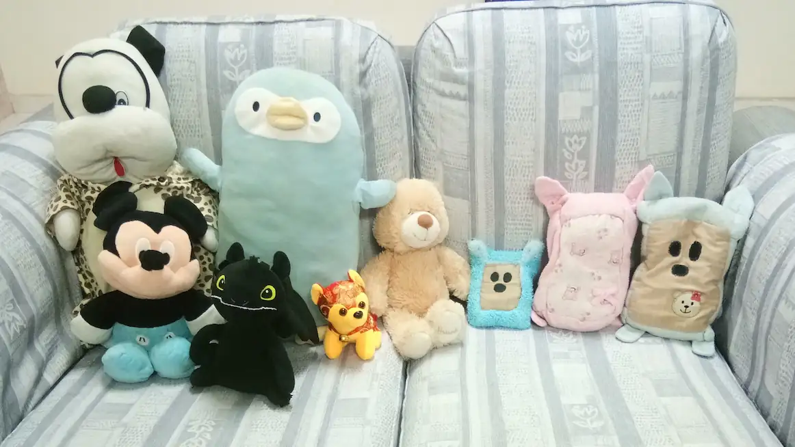
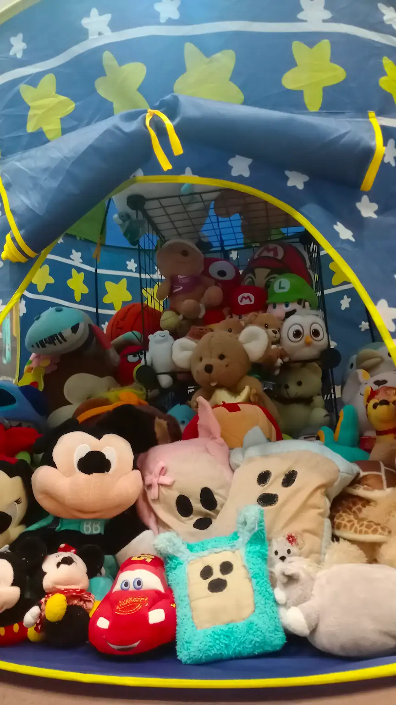
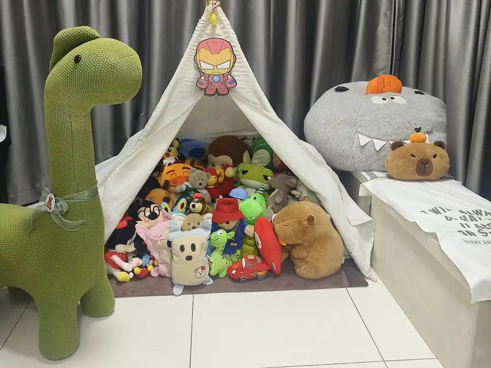
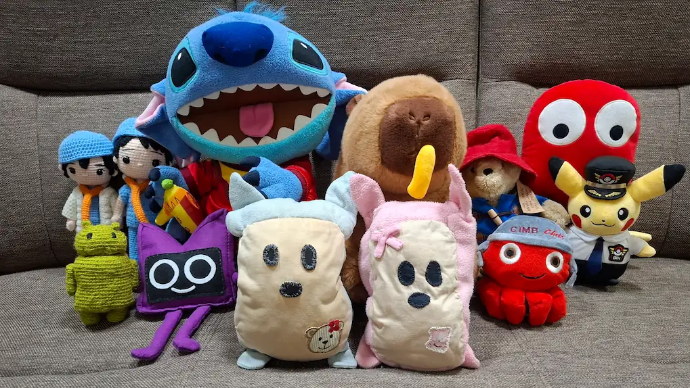

## Some quick questions and answers:

---

### Where is the Plushie Kingdom located?

The Plushie Kingdom is currently located within Penang, Malaysia. All plushies from the previous settlements now reside in this central location. The majority of plushies live under the Big Tent, but other inhabited areas also exist within the greater Plushie Kingdom region.

### Who lives in the Plushie Kingdom?

The Plushie Kingdom is home to plushies from various cultures and countries. We're proud to have a healthy global community of plushies, where everyone can live in harmony. Inclusivity is our top priority, so no matter where you're from, you're always welcome to the Kingdom.

### What is the greater Plushie Kingdom region?

The greater Plushie Kingdom region is a large area composed of several locations which are inhabited by plushies, but are typically not considered to be in the main Plushie Kingdom area, being the Big Tent. However, the entire region is subjected to the same Government laws and policies. More information about each location can be found in the <a class='link' href="/about/safety-and-residency">Safety and Residency</a> page.

### What happened to the Plushie Village?

The Plushie Village was combined with the Plushie Kingdom in The Great Reunification, an event which occured in November 2022. All previous Plushie Village residents now reside in the Plushie Kingdom. More information about this can be found in the <a class='link' href="#history-of-the-plushie-kingdom">History of the Plushie Kingdom section</a> below.

### How old is the Plushie Kingdom?

While the Kingdom, which had a King only began in 2017, the general concept of a large residential commmunity of plushies has existed since its predecessor, the Plushie Village was founded in 2013. Throughout all those years, we've never abandoned our mission of enabling plushies to live life to the fullest!

### How old is the Plushie Kingdom Government?

Compared to the Plushie Kingdom itself, the Government is much younger, being formed in May 2026! The Government was formed to provide a more stable leadership for the Kingdom after the King's departure in 2024, and was first led by Prime Minister Pink Bear Bear, who remains the Prime Minister today.

<h2 id='history-of-the-plushie-kingdom'>History of the Plushie Kingdom</h2>

---

### 2013: The small beginnings of something big

In 2013, a humble house in the small town of Bagan Serai, Perak became the home for several plushies. These plushies didn't know each other before staying here, but quickly formed close bonds, starting the foundation for what would become the Plushie Village.

### 2013-2015: Expansion of the Plushie Village

Within 3 years, the house with the red walls and yellow windows would come to inhabit many more plushies, all with different origins and stories, but united in their deep care and love for each other. Soon, the eldest plushie living in the Plushie Village, Ah Bob would be chosen as the Plushie Village's very first Village Chief, responsible for managing the wellbeing of all plushies living in the Plushie Village.

### 2015-2016: Expedition to Taiwan

  
In June 2015, two prominent residents of the Plushie Kingdom, the then-Village Chief Ah Bob and Pink Bear Bear would be heading on a 1-year expedition to Taiwan. Due to Ah Bob's 1 year absence, another plushie living in the Plushie Village, Stitch would be chosen to replace Ah Bob as the Plushie Village's second Village Chief. He would go on to retain this role until The Great Reunification in November 2022. The two adventurers would bring home an additional resident to the Plushie Village upon their return in June 2016.

  

### 2017-2019: Formation of the Plushie Kingdom

In early 2017, Pink Bear Bear along with 8 other residents of the Plushie Village would migrate from their Perak home to Alor Setar, Kedah. In this new land, a Plushie Kingdom would be formed, with Ah Bob inheriting the role of King from his previous services as the Plushie Village's first Village Chief. From that point on, the Plushie Kingdom would continue to expand and gain new members, soon matching the size of the Plushie Village. Despite that, the two settlements remained in close ties with each other. Residents of the Plushie Kingdom would regularly visit the Plushie Village, and some would even end up staying there, falling in love with the quiet peace of village life.

### 2020-2022: Pandemic and Penang

  
Expansion of the Plushie Kingdom would be paused during the COVID-19 pandemic, as the settlements entered a lockdown. During a brief period of relaxed lockdown regulations in late 2020, the Plushie Kingdom would be relocated to Penang. Gone was their vast but unsheltered land, now replaced with a shiny new castle, where they would spend the rest of the pandemic in. Their new location in Penang shortened the distance for travel between the two settlements, allowing for even closer ties and more frequent visits than ever before. However, there was still a need to travel between the two settlements, leading the Plushie Kingdom and Plushie Village to wonder if they could ever truly be together as one cohesive entity. Fortunately, there would soon be an opportunity to do just that...

  

### 2022: The Great Reunification

On November 2022, work would begin on forming a new, unified Plushie Kingdom, where plushies would always be able to meet each other, only limited by their willingness to do so. This work would result in The Great Reunification, a historic event where the Plushie Village merged with the Plushie Kingdom in a new location in Penang, after 5 years of separation. In honour of their humble village roots, plushies living in the unified Plushie Kingdom would reside in the Big Tent, a structure that resembled the protective confines of the old Plushie Kingdom castle, but constructed to appear village-like and native to the land, as a symbol of unity and inclusivity between the residents of the two settlements. As the Plushie Kingdom was the more prominent settlement of the two, the King Ah Bob would remain the Kingdom's leader, while Stitch would step down as Village Chief, having served in the role for an impressive 7 years.

### 2024: The King's departure

By now, the Plushie Kingdom had grown significantly since its founding in 2017. Moreover, The Great Reunification had brought an even larger increase to the Kingdom's population. In 2024, the King Ah Bob, who had led the Kingdom through a global pandemic and three relocations with a confidence and decisiveness few could match, would step down from his role as King, after a 7-year long reign. He would also no longer reside in the Big Tent, moving to his quieter residence in the Bedroom, which is where he still resides today. His reasons for stepping down remains unclear, but most would attribute it to growing troubles in managing such a massive Kingdom. Whatever the cause may be, the Plushie Kingdom now found itself without a King, having lost a core part of its identity. This Kingdom and its residents had gone through periods of sweeping changes and transformations, with many of them forming lifelong friendships and some even starting families. Now, all they needed was a stable and competent leadership that would continue to support the Kingdom's founding purpose of enabling plushies to live life to the fullest...

### May 2026: Formation of the Plushie Kingdom Government

In 2026, Pink Bear Bear, who had played a major role in leading the Kingdom alongside King Ah Bob as Prince would step up to take the Kingdom's next step forward. Over several months, he would gather a group of plushies to form what would be the Plushie Kingdom's very first Government. On (INSERT DATE HERE!!!!) 2026, this Government would be unveiled to the Plushie Kingdom, promising to deliver real, meaningful change. Pink Bear Bear would take on the role of being the Kingdom's first Prime Minister. Together with his wife as the Deputy Prime Minister, they would lead the Government's 7 other ministries in improving life in the Kingdom.

### Present Day

Today, the Plushie Kingdom has gone a long way from that house with the red walls and yellow windows in Bagan Serai. There's been relocations, a global pandemic and countless new plushies joining the Kingdom. But no matter what, all the Kingdom's plushies will never abandon, and will always strive to achieve that founding purpose that started it all: Enable all plushies to live life to the fullest.
