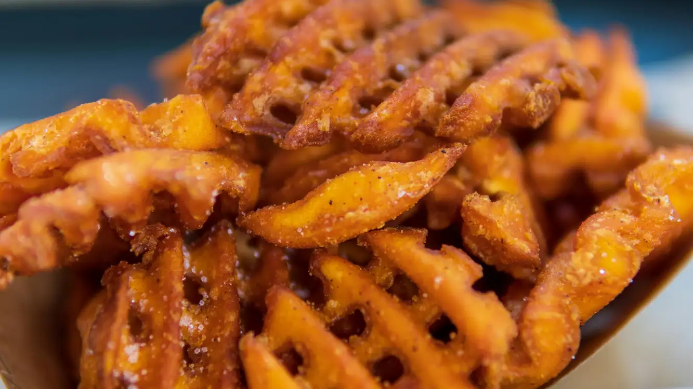
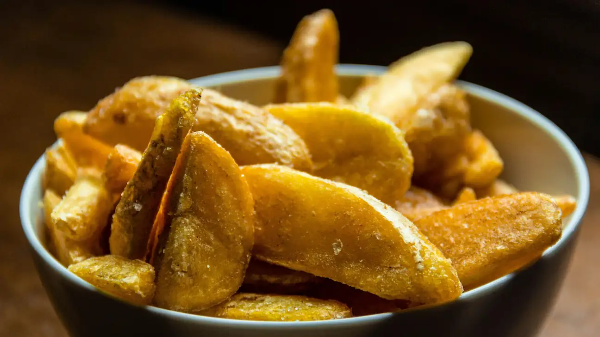
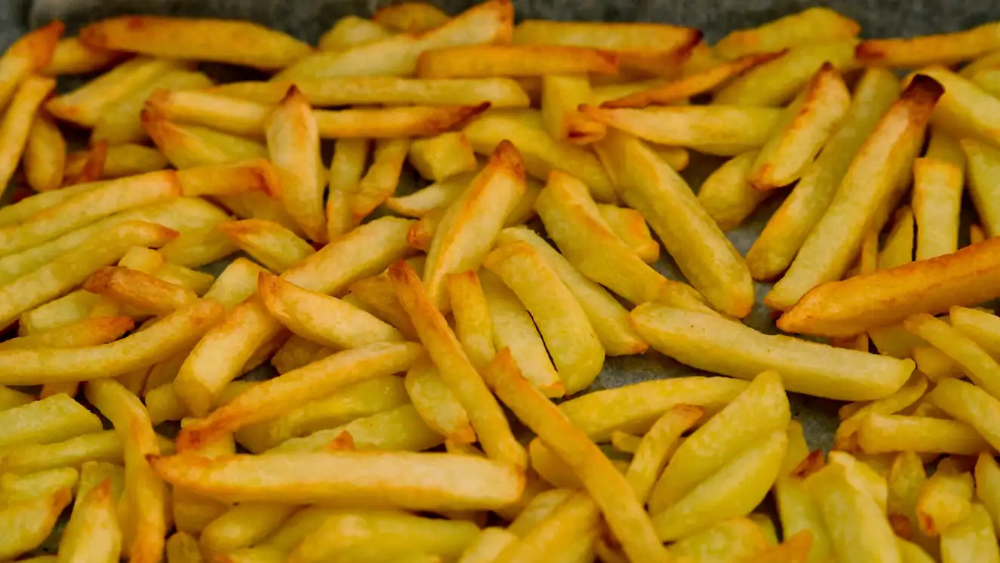
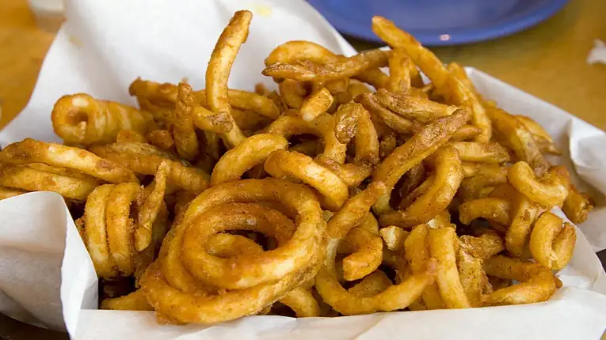
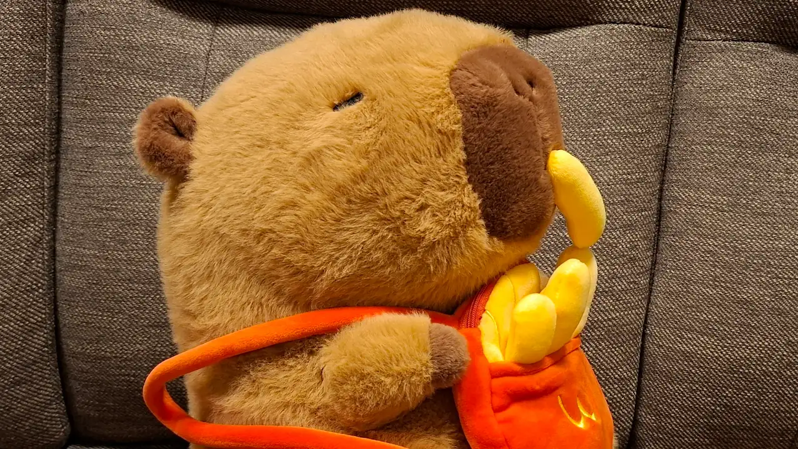

(thumbnail background by <a class='link' href="https://unsplash.com/@abstra_be?utm_source=unsplash&utm_medium=referral&utm_content=creditCopyText" target='_blank' rel='noreferrer'>Durenne Loris</a> on <a class='link' href="https://unsplash.com/photos/a-pile-of-french-fries-sitting-on-top-of-a-table-VzGdnv5URPI?utm_source=unsplash&utm_medium=referral&utm_content=creditCopyText" target='_blank' rel='noreferrer'>Unsplash</a>)

Just arrived in the Kingdom and looking for something to eat? Or maybe you've been around for a while, and you're desperate for something new? Well, you've come to the right place! I'll be guiding you through the best food to eat in the Kingdom. As your Food Minister, you can rest assured that my picks are the real deal!

Let's begin, shall we?

## Number 5: Waffle fries

---

(waffle fries photo by <a class='link' href="https://www.pexels.com/photo/crispy-waffle-fries-5384838/" target='_blank' rel='noreferrer'>Anton Uniqueton from Pexels</a>)

Look, they may be placed last on this list, but that doesn't mean they taste bad, no, not at all! Waffle fries are great when you're looking for something fresh, maybe after several servings of the next few items on this list. Their unique shape might be a bit unusual to me, but some people love it! Besides, its crunchy texture makes it a must-try for any foodie!

## Number 4: Wedges

---

(wedges photo by <a class='link' href="https://www.pexels.com/photo/close-up-photo-of-fried-potato-wedges-3727184/" target='_blank' rel='noreferrer'>Horizon Content from Pexels</a>)

Ahead of waffle fries, we have wedges! They're quickly gaining popularity in many parts of the world, including our very own Plushie Kingdom! Once again, their shape may be polarising, but their crunch definitely does not disappoint! For those who think wedges may be a bit too big for their tastes, take a peek at the next item on our list...

## Number 3: Shoestring Fries

---

(shoestring fries photo by <a class='link' href="https://unsplash.com/@sfkopstein?utm_source=unsplash&utm_medium=referral&utm_content=creditCopyText" target='_blank' rel='noreferrer'>shrage kopstein</a> on <a class='link' href="https://unsplash.com/photos/a-pile-of-french-fries-sitting-on-top-of-a-table-rTXgNusQbus?utm_source=unsplash&utm_medium=referral&utm_content=creditCopyText" target='_blank' rel='noreferrer'>Unsplash</a>)

A common sight in fast-food restaurants, shoestring fries can absolutely be considered an iconic dish here in the Kingdom (at least for me!). The longer ones are usually more mushy, while some of the shorter, deeper-fried ones provide some of the best crunch you'll ever get! Even so, I feel these fries are almost a bit too skinny, like you're not getting much taste with each fry... Fear not, we still have 2 more options that are even tastier than these!

## Number 2: Curly Fries

---

(curly fries photo by <a class='link' href="https://www.flickr.com/photos/18244673@N00/339814087" target='_blank' rel='noreferrer'>pointnshoot on flickr</a>)

These fries usually offer more salt and taste than their straighter, less-seasoned counterparts. They're less commonly found here, so treasure the places that do serve them! I'm a fan of their flavourful taste, but sometimes their curliness really does make eating them a bit of a challenge, unlike the last item on our list...

## Number 1: Steak Fries

---

(steak fries photo by... me!)

And last but certainly not least, we have steak fries! As you can see, I always keep a bag of the stuff around me, showing you how good they taste! These fries are thicker than shoestring fries, but provide the perfect balance of mush and crunch. Whether it's your first day or your thousandth here at the Kingdom, there's no excuse for you to not give these a try!

## Wrapping up

---

Well, that was certainly an exciting (and delicious!) journey through the gourmet wonders of the Plushie Kingdom! I hope you discovered your next meal after reading this, because I certainly did! If you've got any questions, feel free to ask me whenever you see me in the Plushie Kingdom. Now, time to get back to eating, yum!
