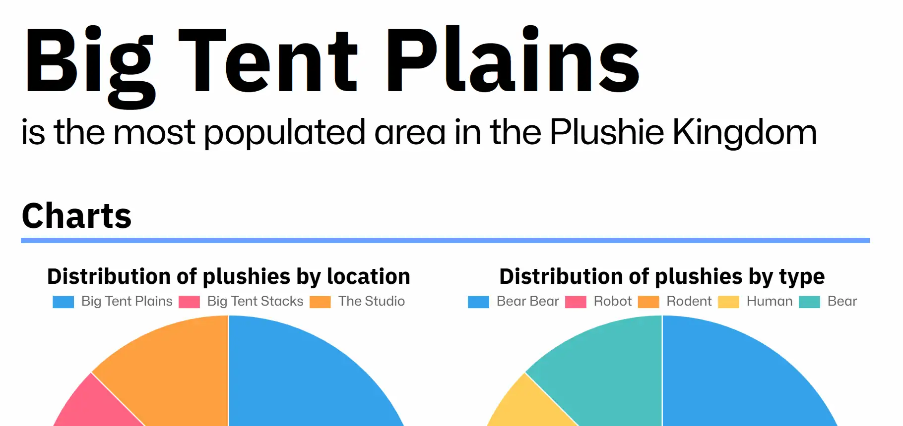
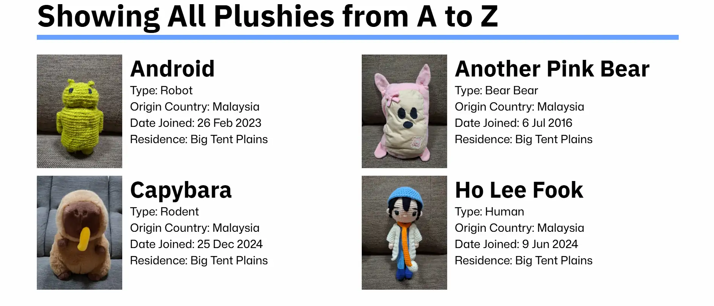
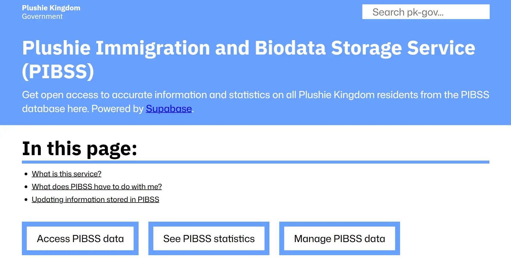

(NOTE: The press release announcing PIBSS is available on <a class='link' href='FILL-THIS-IN' target='_blank' rel='noreferrer'>our YouTube channel</a>)

Today, we're extremely proud to unveil the Government's largest initiative yet. The Plushie Immigration and Biodata Storage Service or PIBSS for short is our biggest update to pk-gov, containing over 160 commits! This introduction will be going over what PIBSS is, how to use it and when its rollout will be completed.

## What this service is

---

PIBSS is the Government's initiative to ensure that no plushie is left out. This service will store basic information about every Plushie Kingdom resident, such as their name, type and location. In support of our efforts to provide open access to information, all data stored in PIBSS will be publicly available for anyone to view. This also enables plushies to quickly notify the Government of any incorrect data, making PIBSS a transparent and accurate data source for the Plushie Kingdom.

## What PIBSS can be used for

---

### Kingdom-wide statistics

As PIBSS provides data on all Plushie Kingdom citizens, we are able to generate detailed statistics about the Kingdom, such as the total population history and distribution of plushies based on location. Besides being pretty to look at, these statistics will guide us in governing the Kingdom, allowing us to identify what can be done to benefit the most plushies.

### Personalised services

PIBSS will be crucial for delivering more personalised services to plushies, as the basic data stored in PIBSS can tell us more about each plushie. For example, better healthcare can be delivered by tailoring treatment and advice to each patient's type and location.

### Keeping track of citizens

All citizens, both existing and new will be registered in PIBSS. This helps us to manage the ever-increasing population of the Plushie Kingdom, and prevents valuable history from being lost to time. Many details about older plushies such as the date they joined the Kingdom have never been recorded. PIBSS will enable the permanent recording of this history, preserving precious information about each plushie!

### Improving safety

The location of all plushies will be stored in PIBSS. This will help prevent plushies from being misplaced, as anyone can check a plushie's residence in the Kingdom with just a few clicks on pk-gov.

## How to use PIBSS

---

If you're an existing plushie, the Ministry of Technology and the Ministry of Immigration will be working to register all existing citizens in PIBSS. For new citizens, registration into PIBSS will happen upon arrival at the Kingdom, ensuring your data is safely recorded from day one. All PIBSS-related content is accessible through the PIBSS Start Page, a new type of page introducing what PIBSS can do. Within the page are three different options...

### Access PIBSS data

This option will take you to a page where you can view all data stored in the PIBSS database. To speed up navigation, there are various filter options and a searchbar, so you can quickly find information from the database. The exact data types stored in PIBSS are:
- Name
- Type
- Origin Country
- Date Joined
- Residence

### See PIBSS Statistics

This page provides informative statistics about Plushie Kingdom citizens. From total citizen count to distribution of plushies by type, data has never looked so interesting! Enabled by <a class='link' href='https://www.chartjs.org/' target='_blank' rel='noreferrer'>Chart.js</a>, some statistics also use graphical charts to better visualise the data in PIBSS.

### Manage PIBSS data

This is where the magic happens! This page is used by Government staff to manage and update data in PIBSS. Although PIBSS data is freely viewable by the public, we've decided to restrict editing the data to Government staff only, ensuring that PIBSS is safe from unauthorised access. The Ministry of Technology designed the plushie registration process to be as simple as possible, so that the new immigration process is quick and easy!

## A new era for the Plushie Kingdom begins today

---

PIBSS has been the result of over 2 months of hard work, and we're proud that it's finally ready for launch! To test it out, all Government staff have already been registered in PIBSS. PIBSS will now be used for all new citizens, while registration of existing citizens will start today with the goal of registering all Plushie Kingdom residents into PIBSS by the end of this year. PIBSS will be the foundation for the Government's mission to deliver real, meaningful change, and we can't wait to see what the future holds for it!