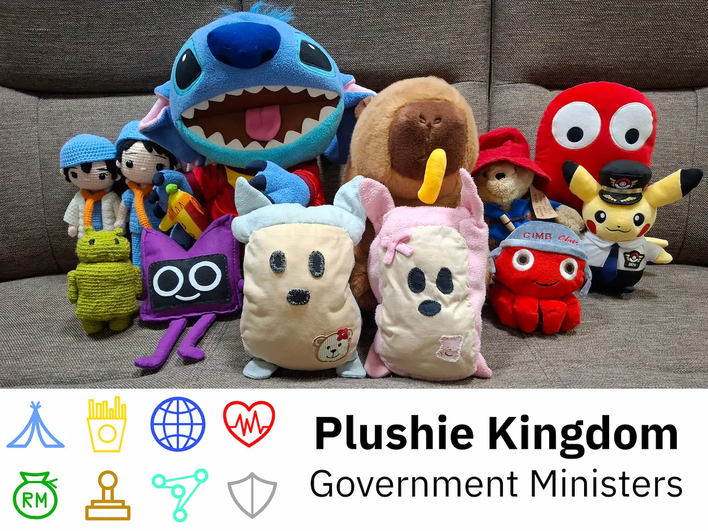

Hello, all plushies and non-plushies alike. Today, I speak to you as Prime Minister, a role that has never been seen before in this Kingdom. Today marks an achievement that has been several months in the making. Over those months, we have been tirelessly working to usher in the future of the Plushie Kingdom, in the wake of our King's departure several years ago.

Since our humble beginnings in that house with the red walls and yellow windows in Bagan Serai, our Village has grown considerably, becoming home to many more plushies and branching out into a Plushie Kingdom. Though separated by many kilometres of highway, these two settlements always remained in good and close relationships with each other. This relationship culminated in The Great Reunification, where countless plushies were finally reunited after years of separation. Throughout that time, plushies formed lifelong bonds, and some even started families.

However, this large expansion did not come without its drawbacks. Plushies who stayed in the outskirts of the settlements became neglected compared to others. Our health providers, bankers and food sellers were unable to effectively reach every plushie. Immigration of new plushies was a haphazard and disorganised process. All of this risked disrupting our founding mission: to enable all plushies to live life to the fullest.

So, we began imagining a better future for the Plushie Kingdom. Imagine a future where no plushie would be left out, all services were easily accessible at any time, and a competent leadership would always take the next step forward to improve the life of all plushies living in the Kingdom. These goals are challenging and will require strong efforts, but achieving them will bring massive improvements to life in the Kingdom. That's why these goals will become the core pillars of our Kingdom, ones we can look at with pride and say: "That's exactly what we did."

Today, that future has finally come to fruition, with the creation of a Plushie Kingdom Government. This isn't just another restructuring of our leadership, it will be the foundation for improved services to all plushies and open access to information. In other words: real, meaningful change is coming. We will take the next step forward in embracing new technologies, to make this Kingdom the best it can be. We will smoothen the immigration process for new plushies and improve management of existing plushies, so that no plushie is left out. We will ensure the Kingdom remains secure, stable and supportive of all plushies that inhabit it. But most of all, we will make sure the Plushie Kingdom is ready to face any new developments and enables all plushies to live life to the fullest.

At the heart of all this, is our website, [pk-gov](/). This website will be the hub where anyone can access all Government information and services. We've made it in collaboration with all the ministries, but especially the Ministry of Technology to make sure the website is intuitive, informative and effective at giving you what you need from us.

The Government will be made up of a Central Ministry and 7 other ministries. The Central Ministry has the final say in Government, and will work with the other ministries in their respective fields. Each minister was put through a rigorous selection process to ensure they were the right fit for the job, and I'm confident in their ability to carry out their tasks well.

More information about each ministry, including who works in them and what they're for will be available on our website and this <a class="link" href="https://youtu.be/EOIrbiDBkyk" target="_blank" rel="noreferrer">video</a>.

All of this makes for an exciting time in the Plushie Kingdom. We can't wait to show you more of what we have planned for the future, so stay tuned to the <a class="link" href="/news/">Government news</a> page on our website for the latest updates and information. Video versions may also be available for major announcements on our <a class="link" href="https://www.youtube.com/channel/UCL4Px1LLyD6WxcaDTm71ViQ" target="_blank" rel="noreferrer">YouTube channel</a>.

Here's to the Plushie Kingdom's bountiful, global, healthy, prosperous, integrated, advanced and secure future. Thank you for reading.
