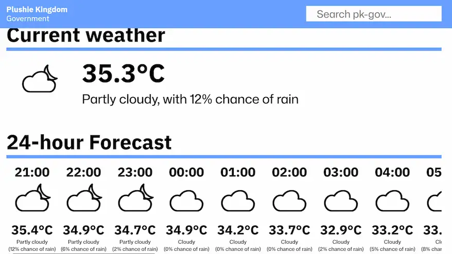
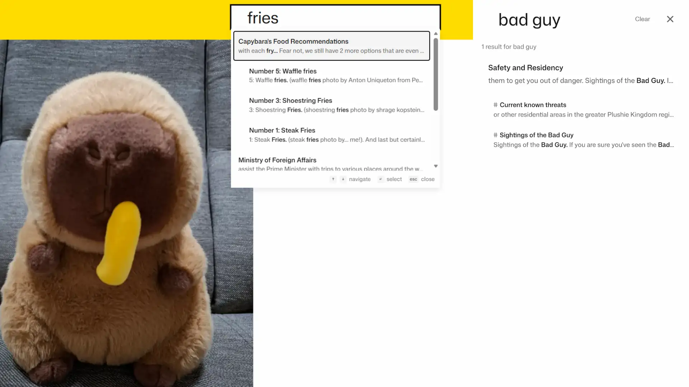

(NOTE: Video version of this announcement is available <a class='link' href='https://www.youtube.com/watch?v=3nKP7c9rNBo' target='_blank' rel='noreferrer'>here</a>)

Today, we're introducing two new features to pk-gov that make it an even better place to access all Government information and services.

## Get local weather information

---

Powered by <a class='link' href='https://open-meteo.com/' target='_blank' rel='noreferrer'>Open-Meteo</a>, our new weather page lets you stay one step ahead of Mother Nature by providing weather updates for the Kingdom and the surrounding George Town area. We provide hourly forecasts for 24 hours, and daily forecasts for 7 days. The weather page can be accessed from the homepage and footer. Any weather alerts will be posted on our <a class="link" href="/news/">Government news</a> page.

## Search for anything on pk-gov

---

As pk-gov continues to expand, it can get difficult to find exactly what you need by browsing through all the pages on the website. Now, you can use the new searchbar (or search icon on mobile) powered by <a class='link' href='https://pagefind.app/' target='_blank' rel='noreferrer'>Pagefind</a> to search for keywords directly. The search results will take you to the relevant section automatically, so you can find what you're looking for faster.

## An update on open-sourcing pk-gov

---

Before I go, I also want to provide an update on our efforts to make pk-gov open-source.

Just a few days ago, we completed the migration of all our ministry pages to 11ty, the static site generator tool we use. This allows all ministry pages to share the same header and footer. Besides enabling faster development and implementation of new features, this was also the first time an external contributor was involved in the development of pk-gov. That first contributor would be <a class='link' href="https://github.com/singyourway" target='_blank' rel='noreferrer'>@singyourway</a>, who helped us in preparing the ministry pages for this transition. The features we revealed today would not have been completed so quickly without her contribution and this migration, so we're glad to see that open-sourcing pk-gov is showing clear benefits in development speed, and we can't wait to see what else open-source will enable pk-gov to achieve!

## Looking ahead

---

These features are just the beginning of our mission to make pk-gov the most intuitive, informative and effective Government resource it can be. More Plushie Kingdom citizens and non-citizens alike are using pk-gov to access Government information and services than ever before, so improving the quality of the website is always the Ministry of Technology's top priority. To keep up with the latest developments, keep an eye on our <a class="link" href="/news/">Government news</a> page and <a class="link" href="https://www.youtube.com/channel/UCL4Px1LLyD6WxcaDTm71ViQ" target="_blank" rel="noreferrer">YouTube channel</a> for the latest updates and information.
