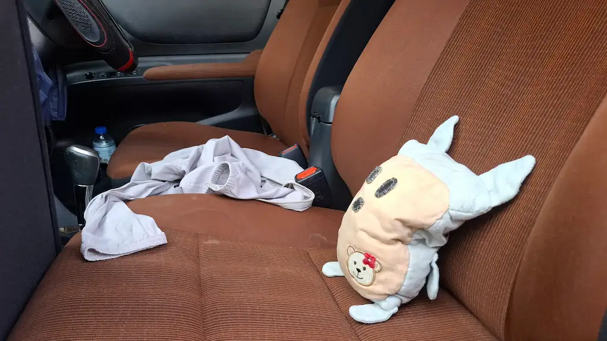
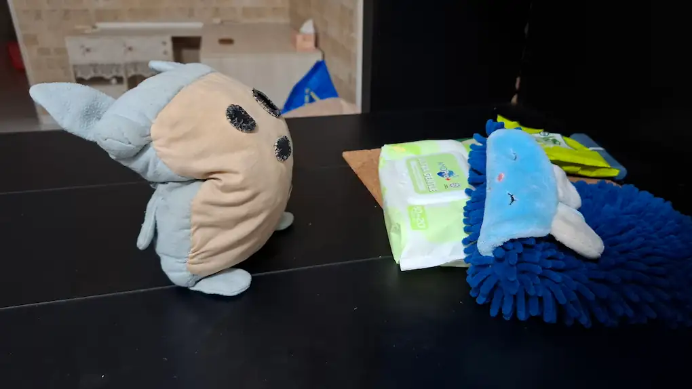
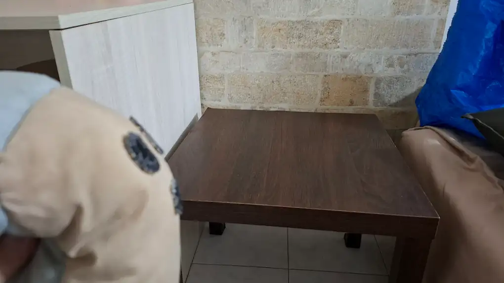
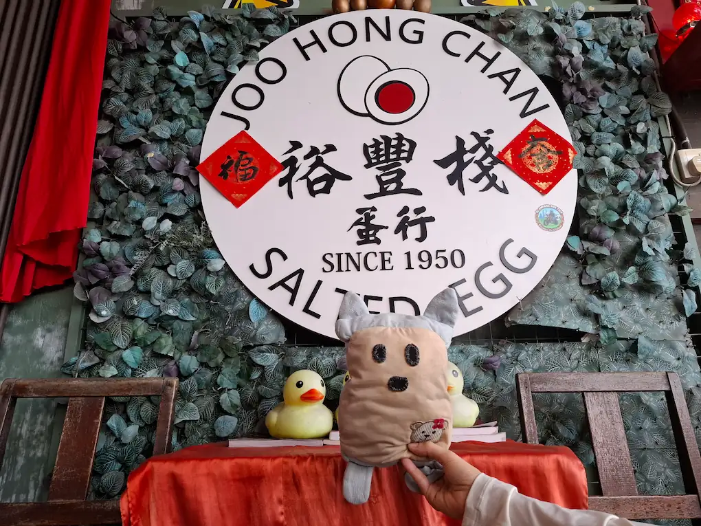
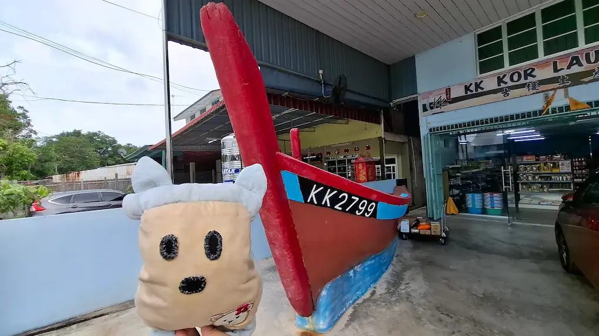
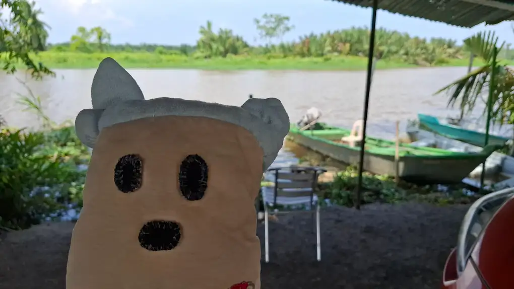
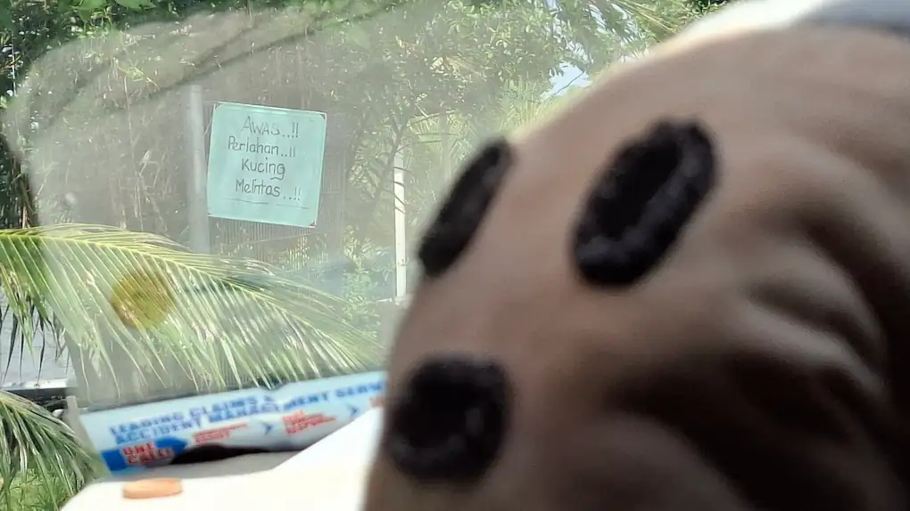
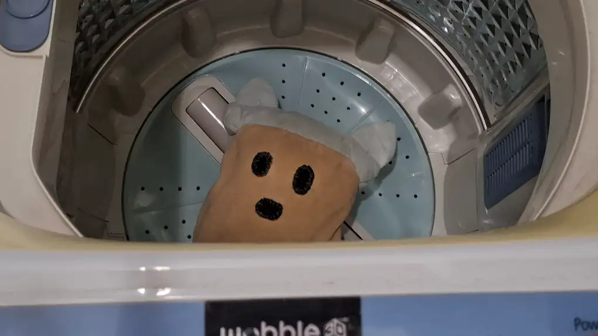
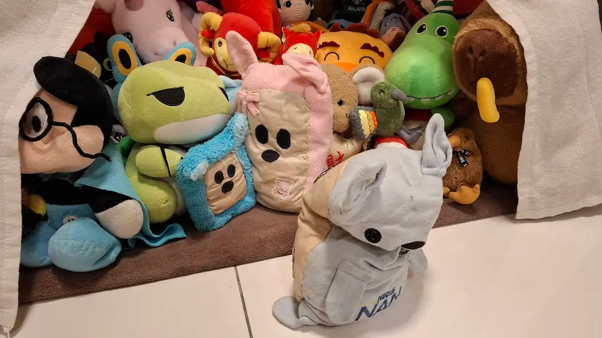

Today, the Prime Minister has concluded his first official visit to Bagan Serai and Kuala Kurau. This report contains details on what happened during the visit.

## Going Places

---

The Prime Minister departed for Bagan Serai at 8.30am, riding in his preferred method of transportation, the Government's official car. This journey was no stranger to him as he had travelled between the Plushie Kingdom and Bagan Serai countless times. However, this particular trip would be his first as the head of Government.

## Reconnecting with history and a local friend

---

At 9.30am, the Prime Minister arrived at the house in Bagan Serai which was home to the Plushie Village. After meeting with a local resident, Pink Bear Bear visited the final location of the Plushie Village before it was demolished, paying respect to the Kingdom's humble roots.

## Visiting Kuala Kurau

---

After spending some time in the house, Pink Bear Bear went off to visit the nearby town of Kuala Kurau, this being his first time travelling there. In Kuala Kurau, the Prime Minister made two stops to learn more about life in the town and take the Kingdom's signature friendliness around the local area.

### Lunch in Kuala Kurau

For lunch, Pink Bear Bear stopped at a salted egg factory containing a small cafe. While there, he also met with several rubber ducks, gaining valuable insights on managing a large settlement and enabling better cooperation with Plushie Kingdom businesses.

### Kuala Kurau's local specialties

After that, the Prime Minister visited a local shop selling Kuala Kurau's specialty goods. The signature fishing boat placed outside the shop proved to be a great photo spot!

## Bagan Serai's sights and signs

---

On the way back from Kuala Kurau, the Prime Minister also stopped by some points of interest in Bagan Serai. The riverbank had seen several new structures built since the Plushie Village was founded, but its natural beauty still remained. The loving and caring spirit of Bagan Serai also did not change, as Pink Bear Bear found that plenty of care was given to pets too!

## Cleaning up and coming home

---

Before returning to the Plushie Kingdom, Pink Bear Bear decided to go through biosecurity at Bagan Serai instead of at the Kingdom to save time. At 9pm, the Prime Minister safely reached home to meet his loving family and the rest of the Plushie Kingdom's citizens. This marked the end of the Prime Minister's first official visit, which was definitely a fruitful and interesting one!

